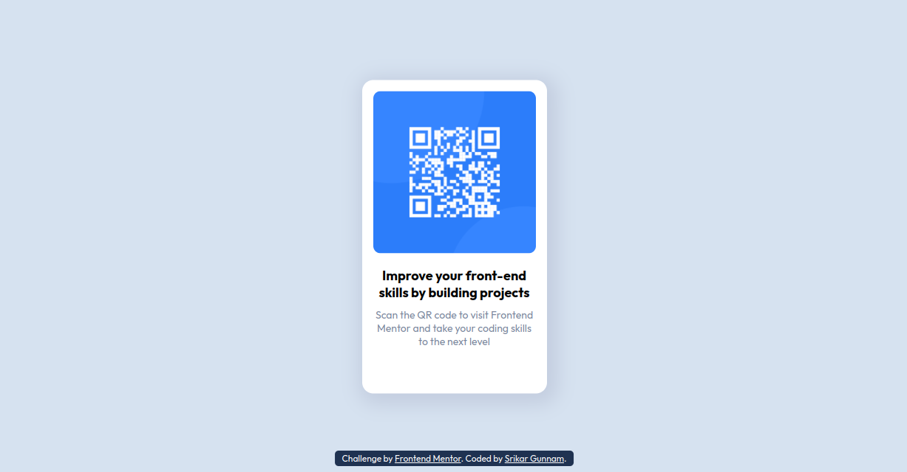

# Frontend Mentor - QR code component solution

This is a solution to the [QR code component challenge on Frontend Mentor](https://www.frontendmentor.io/challenges/qr-code-component-iux_sIO_H). I started my journey with Frontend Mentor, if you are a beginner and want to start building projects, try [Frontend Mentor](https://www.frontendmentor.io/). Frontend Mentor helps you build realistic projects. 

## Table of contents

  - [Overview](#overview)
    - [Screenshot](#screenshot)
    - [Links](#links)
  - [My process](#my-process)
    - [Built with](#built-with)
    - [What I learned](#what-i-learned)
    - [Continued development](#continued-development)
    - [Useful resources](#useful-resources)
  - [Author](#author)

## Overview

### Screenshot

### Links

- Solution URL: [Add solution URL here](https://your-solution-url.com)
- Live Site URL: [Add live site URL here](https://your-live-site-url.com)

## My process

### Built with

- HTML5 markup
- CSS properties
- Mobile-first workflow

### Continued development

I have started implementing rem units for the first time in my project, i would like to gain some sound understanding and continue using them in my future projects.

### Useful resources

- [Image color picker](https://imagecolorpicker.com/) - This helped me to pick colors from images. I really liked this.
- [w3 schools](https://www.w3schools.com/) - This is an amazing HTML and CSS resource which helped me in times i forgot few concepts. I'd recommend it to anyone learning HTML and CSS.

## Author

- Website - [Srikar Gunnam](https://srikargunnam.com)
- Frontend Mentor - [@srikargunnam](https://www.frontendmentor.io/profile/srikargunnam)
- Twitter - [@SrikarGunnam](https://twitter.com/SrikarGunnam)
- Codepen - [@srikargunnam](https://codepen.io/srikargunnam)
- GitHub - [@srikargunnam](https://github.com/srikargunnam/)
